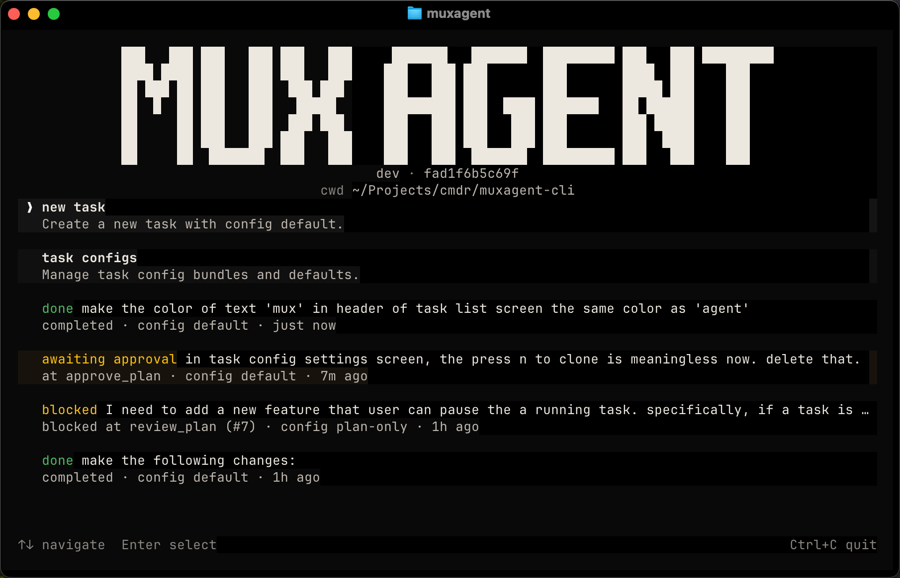

# MuxAgent



MuxAgent orchestrates AI coding agents with workflow graphs and mobile remote
control.

## What MuxAgent Does

- **Task System** — Run coding tasks through graph-based workflows with
  explicit planning, review, approval, implementation, and verification steps.
  MuxAgent ships built-in configs for different risk tolerances and supports
  both Codex and Claude Code runtimes.
- **Remote Control** — Pair the mobile app to monitor and control supported
  agent sessions from your phone, including Claude Code, Codex, Gemini CLI,
  GitHub Copilot, OpenCode, and Goose.

## Installation

### macOS / Linux

```bash
curl -fsSL https://raw.githubusercontent.com/LaLanMo/muxagent/main/install.sh | sh
```

The install script puts `muxagent` in `/usr/local/bin` when writable,
otherwise it falls back to `~/.local/bin`.

### Windows

Download the latest `muxagent-windows-*.zip` bundle from
[GitHub Releases](https://github.com/LaLanMo/muxagent/releases), unzip it, and
run `muxagent.exe`.

Official installs include everything needed to run MuxAgent with Claude Code.

## Quick Start

### Task System

```bash
muxagent
```

This opens the workflow CLI. Pick a task config (`default`, `plan-only`,
`single-run`, `autonomous`, or `yolo`), describe the task, and MuxAgent routes
the agent through the workflow for you.

### Remote Control


1. Download the MuxAgent mobile app.
   [Google Play](https://play.google.com/store/apps/details?id=ai.soloflux.muxagent) | [App Store](https://apps.apple.com/us/app/muxagent-remote-coding/id6761751534).
2. Run:

   ```bash
   muxagent daemon start
   ```

3. Scan the QR code in the app to finish setup.

On a new machine, `muxagent daemon start` begins first-time setup, shows a QR
code, waits for approval in the mobile app, and then starts the daemon.

You can also run `muxagent auth login` manually if you want to pair before
starting the daemon.

After pairing, the mobile app can connect to supported runtimes such as Claude
Code, Codex, Gemini CLI, GitHub Copilot, OpenCode, and Goose.

## Workflow Graphs

A task config defines a workflow graph: the sequence of nodes and edges that an
AI agent follows while working on a task.

**`default`** — When you want human sign-off before code changes land.

```
        ┌─────────────────────────┐
        │  (approval rejected)    │
        ▼                         │
       plan ──▶ review ──▶ approve ──▶ implement ──▶ verify ──▶ done
        ▲         │                      ▲              │
        └─────────┘                      └──────────────┘
     (review rejected)                    (verify failed)
```

**`plan-only`** — When you want a reviewed plan without touching code.

```
       plan ──▶ review ──▶ done
        ▲         │
        └─────────┘
     (review rejected)
```

**`single-run`** — Handle one request once, then stop.

```
   handle_request ──▶ done
```

**`autonomous`** — When you trust the agent and want fast iteration.

```
       plan ──▶ review ──▶ implement ──▶ verify ──▶ done
        ▲         │           ▲              │
        └─────────┘           └──────────────┘
     (review rejected)         (verify failed)
```

**`yolo`** — Fully autonomous multi-wave mode. No approval, no clarification.

```
       ┌──────────────────────────────────────────────────┐
       │                                    (next wave)   │
       ▼                                                  │
      plan ──▶ review ──▶ implement ──▶ verify ──▶ evaluate ──▶ done
       ▲         │           ▲              │
       └─────────┘           └──────────────┘
    (review rejected)         (verify failed)
```

Workflow configs are different from runtime selection:

- a workflow config chooses the graph, bundled prompts, and product intent
- runtime selection chooses which coding runtime executes agent nodes, for
  example `codex` or `claude-code`

## Customize Workflows

The included workflow configs are stored as task config bundles under
`~/.muxagent/taskconfigs`. You can clone them and modify the YAML to change the
workflow graph, prompts, runtime, iteration limits, or clarification settings.

See [CLI docs](cli/README.md) for the full command set and
[Task Config Semantics](cli/docs/task-config-semantics.md) for the workflow
schema, edge semantics, and output contract.

## Monorepo Surfaces

This repository is a monorepo for the product's different surfaces:

- `cli/` — Go CLI, app-server, updater, and bundled workflow configs
- `mobile/` — Flutter mobile app
- `desktop/` — desktop shell
- `relay/` — relay service

Surface-specific docs:

- [CLI](cli/README.md)
- [Mobile](mobile/README.md)
- [Desktop](desktop/README.md)
- [Relay](relay/README.md)
