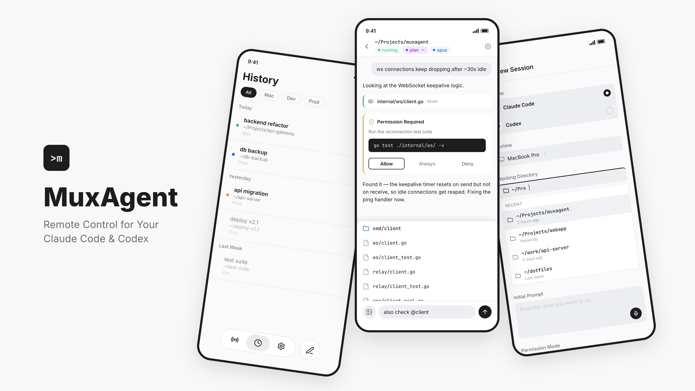

# MuxAgent



**Your AI coding agents, remote-controlled from your phone.**

Claude Code, Codex, Gemini CLI, GitHub Copilot, OpenCode, and Goose run on
your dev machine — MuxAgent lets you drive them from anywhere. Pair the
mobile app to a daemon on your Mac, Linux, or Windows box and monitor,
prompt, and approve sessions from your pocket.

## Installation

### macOS / Linux

```bash
curl -fsSL https://raw.githubusercontent.com/LaLanMo/muxagent/main/install.sh | sh
```

The install script puts `muxagent` in `/usr/local/bin` when writable,
otherwise it falls back to `~/.local/bin`.

### Windows

Download the latest `muxagent-windows-*.zip` bundle from
[GitHub Releases](https://github.com/LaLanMo/muxagent/releases), unzip it, and
run `muxagent.exe`.

Official installs include everything needed to run MuxAgent with Claude Code.

## Quick Start

You can be driving a Claude Code session from your phone in under a minute.

1. Install the MuxAgent mobile app.
   [Google Play](https://play.google.com/store/apps/details?id=ai.soloflux.muxagent) | [App Store](https://apps.apple.com/us/app/muxagent-remote-coding/id6761751534)
2. On your dev machine, start the daemon:

   ```bash
   muxagent daemon start
   ```

3. Scan the QR code in the app to pair. First run walks through setup, then
   starts the daemon.

Once paired, pick any supported runtime — Claude Code, Codex, Gemini CLI,
GitHub Copilot, OpenCode, or Goose — and you are attached to a live session.

Pairing keys and session traffic are described in
[SECURITY.md](SECURITY.md).

## CLI Commands

Everything the mobile flow needs lives under a handful of commands:

**Daemon**

- `muxagent daemon start` — First-time setup, or start the daemon in the background.
- `muxagent daemon status` — Check whether the daemon is running.
- `muxagent daemon stop` — Stop the daemon.
- `muxagent daemon attach-session <session-id> --runtime <runtime>` — Attach an existing local runtime session (e.g. `--runtime claude-code`) so the mobile app can continue it.

**Auth / pairing**

- `muxagent auth login` — Pair a mobile device via QR code.
- `muxagent auth status` — Show current pairing status.
- `muxagent auth logout` — Remove stored credentials.

**General**

- `muxagent version` — Print the installed version.
- `muxagent update` — Update to the latest release.
- `muxagent health` — Check daemon health.

Full command reference lives in [cli/README.md](cli/README.md).

## Coming Soon: Desktop Workflow Graphs

The upcoming MuxAgent **Desktop** app runs coding tasks through graph-based
workflows with explicit planning, review, approval, implementation, and
verification steps. Five bundled configs cover different risk tolerances
— from strict human sign-off to fully autonomous multi-wave runs.

The `default` graph, for example, requires human approval before any code
lands:

```
        ┌─────────────────────────┐
        │  (approval rejected)    │
        ▼                         │
       plan ──▶ review ──▶ approve ──▶ implement ──▶ verify ──▶ done
        ▲         │                      ▲              │
        └─────────┘                      └──────────────┘
     (review rejected)                    (verify failed)
```

See [the full set of workflow graphs](cli/README.md#workflow-graphs)
(`plan-only`, `single-run`, `autonomous`, `yolo`) and
[Task Config Semantics](cli/docs/task-config-semantics.md) for the schema,
edge semantics, and output contract.

## Monorepo Surfaces

- `cli/` — Go CLI, app-server, updater, and bundled workflow configs
- `mobile/` — Flutter mobile app
- `desktop/` — desktop shell
- `relay/` — relay service

Surface-specific docs:

- [CLI](cli/README.md)
- [Mobile](mobile/README.md)
- [Desktop](desktop/README.md)
- [Relay](relay/README.md)
